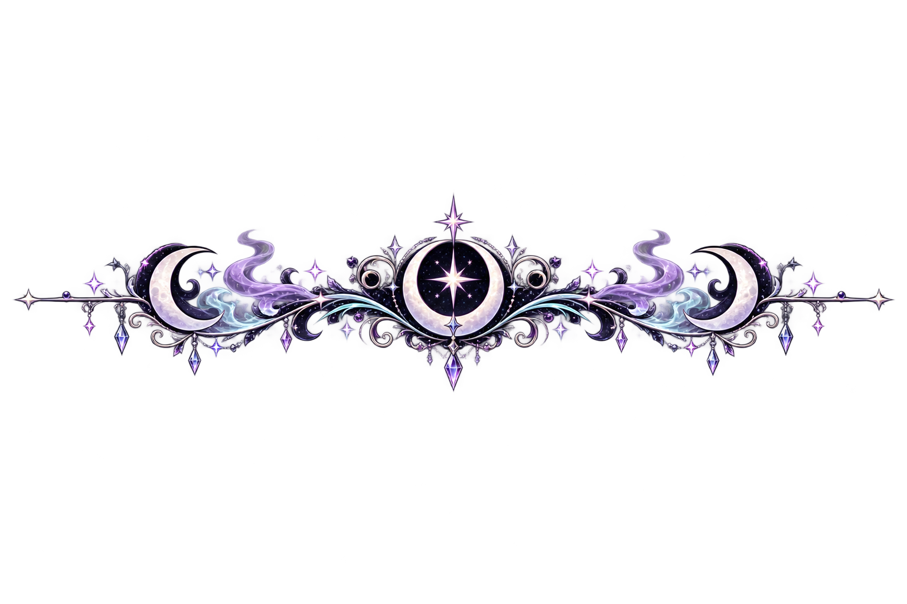
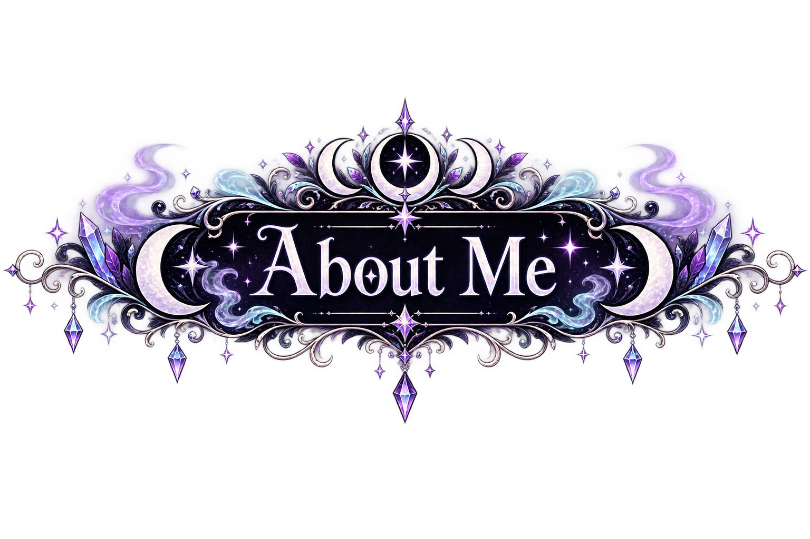
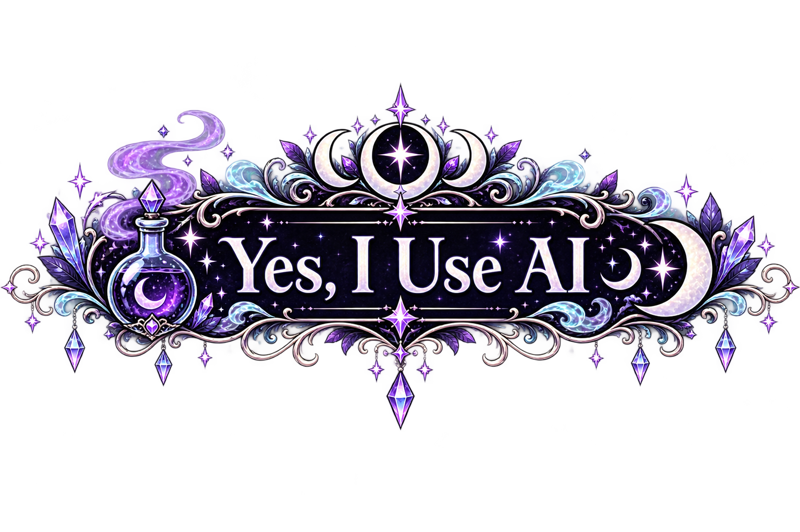
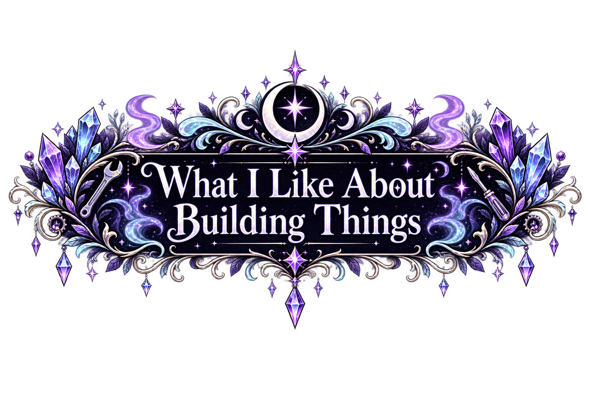
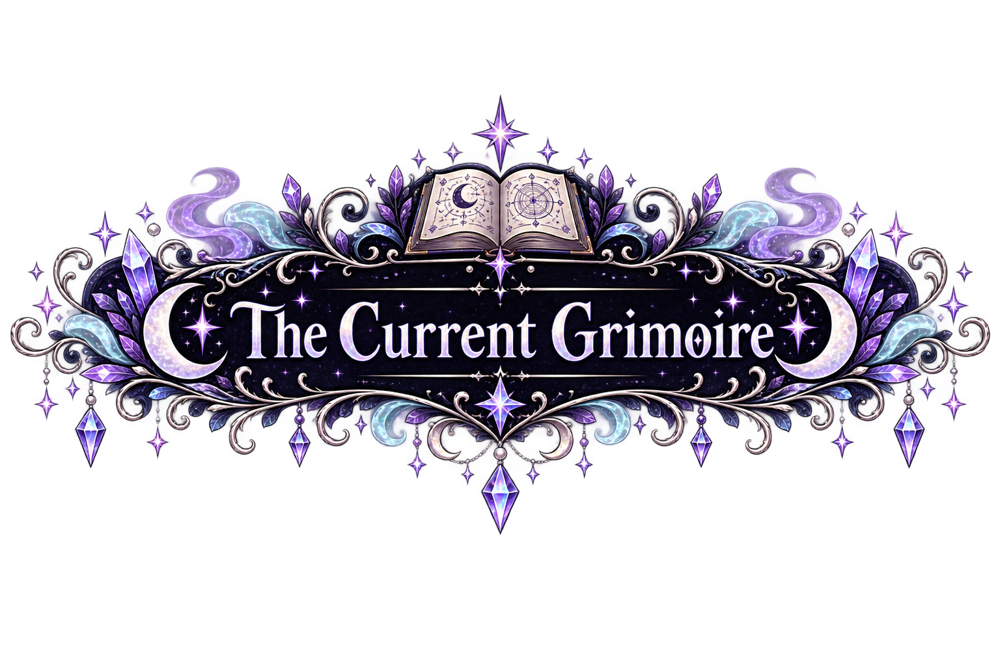
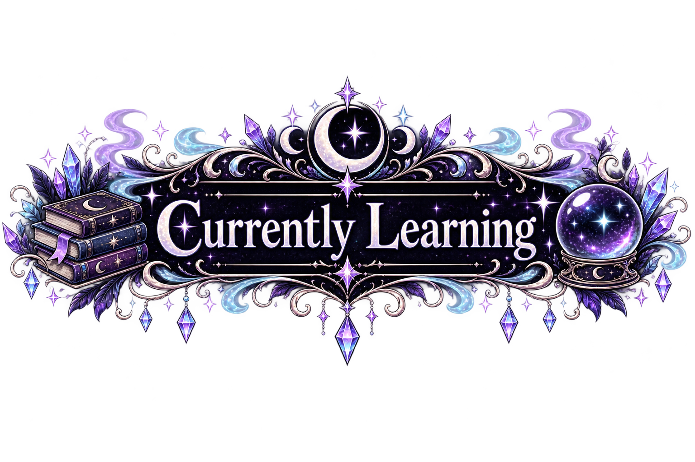
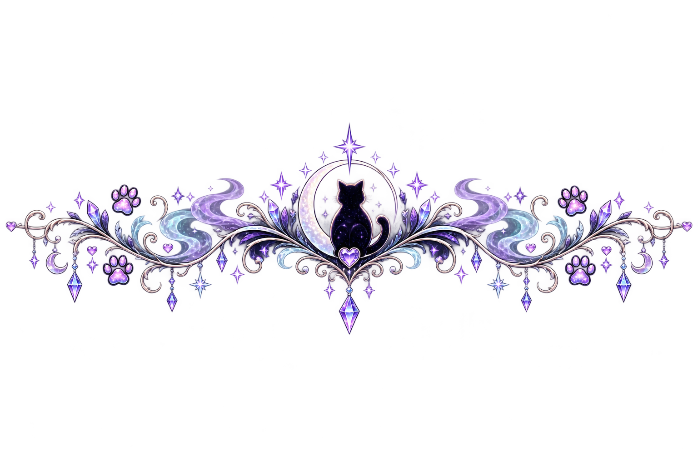
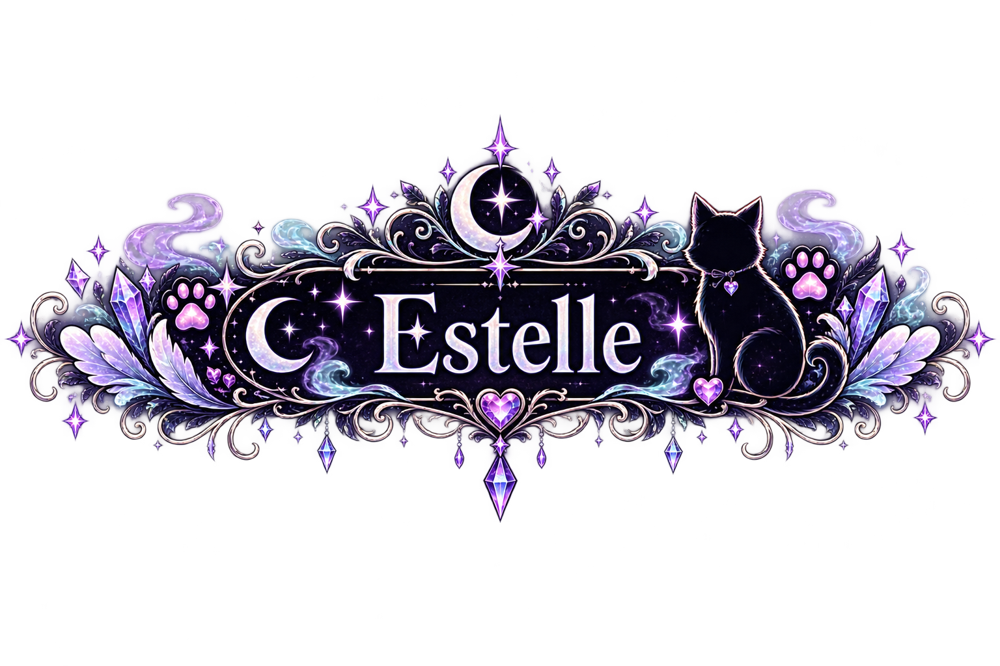
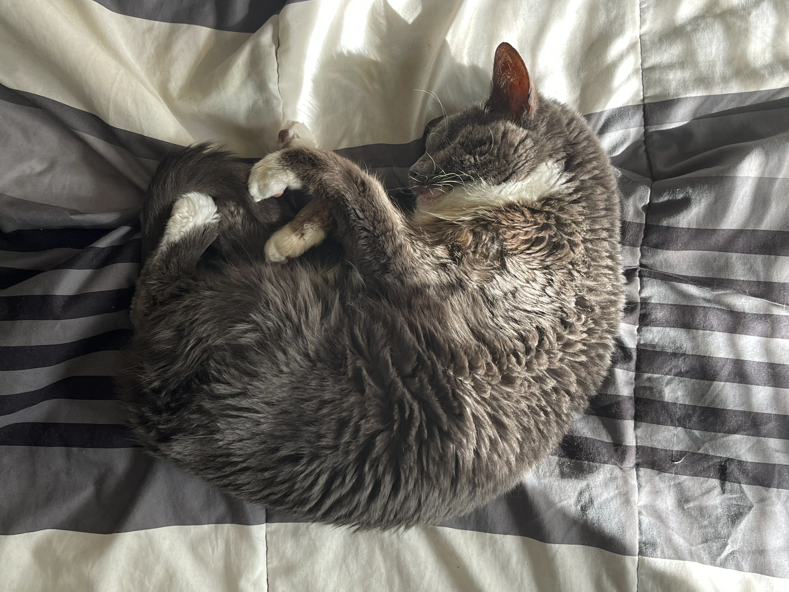

<!--
    ☾⋆｡𖦹 °✩ ATARAXIAGODDESS ✩° 𖦹｡⋆☽

    you've entered the grimoire.
    proceed accordingly.
-->

# ☾ AtaraxiaGoddess ☽

### 🔮 hobbyist developer • problem solver • perpetual student • resident spooky bitch

I make things because I enjoy being useful, solving problems, and being creative.

 

`useful > impressive` · `quality > speed` · `empathy > extraction`

  

⋆｡°✩ 🕯️ 🐈‍⬛ 🌙 🔮 🌙 🐈‍⬛ 🕯️ ✩°｡⋆

  

<table align="center">
<tr>
<td width="760">

I'm a hobbyist/indie developer who likes building things that make everyday life a little easier. Programming isn't my career, and I don't particularly want it to be; it's something I came back to because I enjoy the creativity, problem solving, and giant-puzzle feeling of taking an idea that only exists in my head and slowly turning it into something real.

I don't care about building a SaaS in a weekend, racing something into production, or proving how quickly I can churn out code. I care whether the thing actually solves the problem it was supposed to solve. There is usually some chaos involved (sometimes quite a lot of it) but there is structure in the chaos. I'll research, experiment, break things, rebuild them, change my mind, learn something new, and keep going until I've made something I actually feel comfortable putting into another person's hands.

</td>
</tr>
</table>

### ✦ I'd rather take too long making something good than rush something bad out the door. ✦

 

<b>🌒 How I Ended Up Programming Again</b>

 

<table align="center">
<tr>
<td width="760" align="left">

I originally studied programming in college, and it didn't go especially well. At the time, I was dealing with undiagnosed mental health problems, undiagnosed neurodivergence, survival mode, and a whole collection of things I didn't yet have the language or tools to understand. Eventually programming became one of those parts of myself I left behind.

For years, though, I had an idea for an app I wanted to make. I had a problem in my own life, I knew what I wished existed to solve it, and I kept carrying the idea around without ever finding the time (or really knowing how) to turn it into something tangible.

Then I broke my foot.

Suddenly, I had **way more time than I knew what to do with.**

So I started again.

That long-standing personal problem became **Budget Brewer**, and Budget Brewer became my way back into programming. I'm still relearning, still figuring things out, and definitely still finding gaps in what I understand, but this time I've also found a way of learning that works much better for me.

</td>
</tr>
</table>

 

<table align="center">
<tr>
<td width="760">

A lot. I'm not interested in pretending otherwise.

AI has become part instructor, part guide, part pair programmer, part debugger, part research assistant, and occasionally a rubber duck that talks back. It helps me work through concepts that didn't click for me through more traditional methods, gives me a place to ask the same question five different ways when necessary, and gives me enough momentum to turn ideas into things I can actually interact with and learn from.

Sometimes it explains something until I finally understand it. Sometimes it gives me code that I adapt. Sometimes I copy something almost verbatim. Sometimes it confidently hands me absolute garbage and I spend the next several hours figuring out *why* it's garbage.

I don't want to manufacture expertise I don't have, and I'm not going to pretend every line in these repositories sprang fully formed from my own brain. My development process is AI-assisted. At the same time, the decisions are still mine: what I want to build, how it should behave, what the interface should feel like, which tradeoffs I'm willing to make, whether a proposed solution actually makes sense, what gets rejected, what gets rewritten, and ultimately what I'm willing to ship.

I'd rather be transparent about how I learn and build than hide the tools that helped me get here.

</td>
</tr>
</table>

<table align="center">
<tr>
<td width="760">

Programming scratches the same part of my brain as solving a giant puzzle. There is something deeply satisfying about watching a mess of disconnected pieces slowly become a working system, and there is absolutely a rush when something you've built finally **works** — even if it only works *mostly*, even if three other things are now broken, and even if you immediately discover six things you want to change.

Because once I know something *can* work, the remaining problems become things I can solve.

Of everything I've explored so far, **UI design** is probably the part that has clicked with me the most. I like thinking about how something should feel to use, what information actually matters, where it belongs, how different pieces relate to one another, and how to make an interface feel intentional rather than merely functional.

I'm less interested in writing code for the sake of writing code than I am in using technology to create something useful.

</td>
</tr>
</table>

<h2 align="center">🧪 The Part I Have Absolutely Neglected</h2>

<table align="center">
<tr>
<td width="760">

**Testing.**

Somehow, despite everything I've worked on, I have never written a software test. Not one. Unit tests, integration tests, UI tests — I understand what they're *for*, but actually writing them is a part of software development I managed to completely sidestep.

I don't intend to leave it that way forever. Learning how to properly test my own software is firmly on the list.

Until then, this section exists as public evidence that I am aware of my crimes.

</td>
</tr>
</table>

<h2 align="center">🪄 What I Build</h2>

<table align="center">
<tr>
<td width="760">

I don't currently have ambitions to invent the next revolutionary platform, and that's not really what draws me to development anyway. I like **quality-of-life software**: useful things, practical things, things that solve annoying everyday problems, things I wish somebody had already made, and occasionally things I get tired of waiting for somebody else to make.

<h3 align="center">🫧 Budget Brewer</h3>

**Budget Brewer** started as a problem in my own life long before it became a repository. I wanted a budgeting tool that worked the way *my brain* needed a budgeting tool to work, and eventually I stopped waiting for it to exist and started trying to build it myself.

Budget Brewer isn't a startup pitch, and it isn't the beginning of my SaaS empire. It's a tool I wanted to exist.

**So I'm making it exist.**

</td>
</tr>
</table>

<h2 align="center">🕸️ Software, Money & Why I Have Opinions™</h2>

<table align="center">
<tr>
<td width="760">

A lot of my choices as a developer are influenced by how I think people ought to treat one another. I'm anti-capitalist, and that absolutely leaks into the things I build.

I don't believe every useful object, interaction, service, or piece of knowledge needs to become an opportunity to extract as much money as possible from somebody. I'm especially uncomfortable with basic tools that people may need **because they're already struggling financially** being placed behind subscriptions and paywalls.

That doesn't mean I believe people's work has no value. People doing real work deserve to be compensated for it. What bothers me is the idea that virtually every human need, skill, interaction, hobby, convenience, and piece of knowledge must eventually be reduced to a transaction designed around maximum extraction.

I've always liked the idea of exchange being rooted more deeply in community, reciprocity, skill, generosity, and mutual usefulness. You know how to write beautiful words and I know how to build something? Maybe someday you help me with the words, and I help you build the thing.

The world could stand to contain a little more of that.

And a lot more empathy.

</td>
</tr>
</table>

<table align="center">
<tr>
<td valign="top" width="50%" align="center">

<h3>🔧 Things I Use</h3>

<kbd>Kotlin</kbd>&nbsp;
<kbd>XML</kbd>&nbsp;
<kbd>Android</kbd>

  

<kbd>Android Studio</kbd>

  

<kbd>Git</kbd>&nbsp;
<kbd>GitHub</kbd>

  

<kbd>Inkscape</kbd>

</td>
<td valign="top" width="50%" align="center">

<h3>🧠 Things I Tinker With</h3>

<kbd>UI / UX Design</kbd>

  

<kbd>Local AI & LLMs</kbd>

  

<kbd>AI-Assisted Development</kbd>

  

<kbd>Automation & Tooling</kbd>

  

<kbd>Whatever Rabbit Hole I Found</kbd>

</td>
</tr>
</table>

<table align="center">
<tr>
<td width="760">

I'm not trying to collect technologies like merit badges. If I need something, I'll learn enough about it to solve the problem in front of me — and then there's a decent chance I'll keep digging because now I want to know how the damn thing works.

</td>
</tr>
</table>

<table align="center">
<tr>
<td width="760">

Not everything I'm learning happens inside an IDE.

For a long time, free time wasn't something I was particularly good at *having*. Different parts of my life were spent working myself into the ground, living according to somebody else's wants, surviving circumstances that left very little room for me, or eventually just doom-scrolling until it was time to sleep.

So lately I'm learning something much less technical: **how to have a life that actually belongs to me.**

I'm learning how to make time for hobbies again, how to be curious without needing that curiosity to become productive, how to enjoy something without feeling like I need to earn the right first, and how to make things simply because making them feels good.

I'm still figuring out who I am when I'm not just surviving.

And yes, at some point I also need to learn how to write a damn unit test.

</td>
</tr>
</table>

<h2 align="center">🔮 Outside the IDE</h2>

<table align="center">
<tr>
<td align="center" width="33%">🌙 <b>Magic</b></td>
<td align="center" width="33%">🎮 <b>Video Games</b></td>
<td align="center" width="33%">📚 <b>Reading</b></td>
</tr>
<tr>
<td align="center">🐈‍⬛ <b>Cats</b></td>
<td align="center">🎃 <b>Halloween</b></td>
<td align="center">👻 <b>All Things Spooky</b></td>
</tr>
</table>

<table align="center">
<tr>
<td width="760">

Witchcraft, paranormal nonsense, horror, the supernatural, the macabre, cats, books, and strange little fictional worlds I can disappear into all occupy some part of my orbit.

I'm still rediscovering what I enjoy. There are pieces of me that spent a very long time surviving instead of living, and others that still feel frozen somewhere between survival and grief.

**I'm interested in finding out what grows in the space survival used to occupy.**

</td>
</tr>
</table>

 

 

<table align="center">
<tr>
<td width="760">

The original version of my GitHub profile used to say:

> **🔮 Ask me about my eyeless cat**

I wrote that while she was still alive.

After she died, I couldn't bring myself to remove it. I only added the words **"(may she rest in peace)"** to the end.

Her name was **Estelle**. She was my eyeless cat, my soulcat, and one of the deepest reasons I kept moving through parts of my life that otherwise felt impossible.

I still haven't figured out how to describe what losing her did to me without sanding the truth down into something prettier and more comfortable than it actually was, so I won't.

It was devastating. It still is.

Grief did not arrive, teach me a meaningful lesson, and politely leave when its work was finished. There are parts of me that still feel frozen around the place where she disappeared. She was safety, home, family, companionship, and a kind of love that permanently changed the shape of my life.

She is still one of my core reasons for continuing forward.

I carry her with me in ways that are difficult to explain and impossible to remove. The fact that she is gone doesn't make her a closed chapter, and I don't want to speak about her exclusively in the past tense as though death somehow erased the relationship.

So the invitation from the old profile still stands:

</td>
</tr>
</table>

### **Ask me about my eyeless cat.**

I will always want the world to know that she was here.

🐾

Some souls leave pawprints far deeper than they ever knew.

  

<b>🕯️ Find Me Elsewhere</b>

 

**Discord:** [AtaraxiaGoddess](https://discord.com/users/533815184142106626)

**Twitter / X:** [@AtaraxiaGoddess](https://x.com/AtaraxiaGoddess)

 

For anything related to one of my projects, opening an issue or discussion on the relevant repository is perfectly welcome too.

  

 

### ☾⋆｡𖦹 °✩ 𓆩♡𓆪 ✩° 𖦹｡⋆☽

 

**Solve the problem. Learn the thing. Make it useful.**

 

No startup grindset required.

<!--
    end of grimoire.

    if you read the source:
    hello, fellow creature of the dark.
-->
